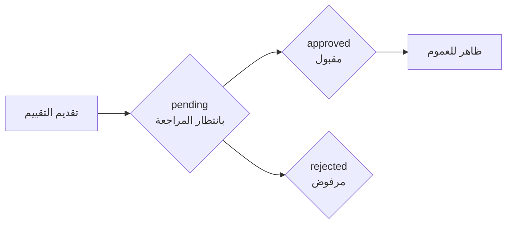

# Product Reviews API Documentation

## Reviews Management | إدارة التقييمات

Endpoints لعرض وإدارة تقييمات المنتجات.

Manage product reviews and ratings.

### Features | المميزات

- **Multi-type Reviews**: تقييمات المنتجات، الشحن، المتجر، والطلبات | Product, shipping, store, and order reviews
- **Purchase Verification**: التقييم مقتصر على المشترين فقط | Reviews limited to actual purchasers
- **Moderation System**: جميع التقييمات تحت المراجعة | All reviews go through moderation
- **Time-bound Editing**: يمكن التعديل خلال 30 يوم فقط | Editing allowed within 30 days only
- **Rich Filtering**: تصفية حسب المنتج، التقييم، النوع، والترتيب | Filter by product, rating, type, and sorting
- **Customer Privacy**: عرض الأسماء مختصرة لحماية الخصوصية | Display abbreviated names for privacy
- **Pagination**: دعم الترقيم الصفحي للنتائج الكبيرة | Support pagination for large result sets

### Endpoint Types | أنواع النقاط الطرفية

#### Public Endpoints (بدون تسجيل)

- `GET /store/reviews` - عرض التقييمات العامة | View public reviews

#### Authenticated Endpoints (تتطلب تسجيل)

- `POST /store/reviews` - إضافة تقييم جديد | Add new review
- `PATCH /store/reviews/:id` - تعديل تقييم موجود | Update existing review
- `DELETE /store/reviews/:id` - حذف تقييم | Delete review
- `GET /store/reviews/can-review` - التحقق من إمكانية التقييم | Check review eligibility

---

## Endpoints | النقاط الطرفية

### 1. List Reviews | عرض التقييمات

#### Request | الطلب

```http
GET {{base_url}}/store/reviews?product_id=1&per_page=15
```

#### Headers | الرؤوس

```
X-Store-Key: {{store_key}}
Accept: application/json
Accept-Language: ar
```

#### Query Parameters | معاملات الاستعلام

| Parameter | Type | Required | Description | الوصف |
| --- | --- | --- | --- | --- |
| `product_id` | integer | No | تقييمات منتج محدد | Filter by specific product |
| `my_reviews` | boolean | No | تقييماتي (يتطلب Auth) | My reviews (requires Auth) |
| `type` | string | No | `product`, `shipping`, `store`, `order` | Review type |
| `rating` | integer | No | `1` - `5` (فلترة حسب النجوم) | Filter by star rating |
| `sort` | string | No | `created_at`, `rating` | Sort field |
| `order` | string | No | `asc`, `desc` | Sort order |
| `per_page` | integer | No | عدد العناصر لكل صفحة (افتراضي: 15) | Items per page (default: 15) |

#### Description | الوصف

عرض تقييمات مع فلاتر متعددة باستخدام Query Params.

Display reviews with multiple filtering options using query parameters.

#### Examples | أمثلة

```bash
# تقييمات منتج محدد
GET /store/reviews?product_id=1

# تقييماتي الخاصة
GET /store/reviews?my_reviews=true

# تقييمات الشحن فقط
GET /store/reviews?type=shipping

# تقييمات 5 نجوم مرتبة من الأحدث
GET /store/reviews?rating=5&sort=created_at&order=desc

# 10 تقييمات لكل صفحة
GET /store/reviews?per_page=10&page=2
```

#### Response | الرد

```json
{
    "success": true,
    "message": "تم جلب التقييمات بنجاح",
    "data": [
        {
            "id": 9,
            "rating": 5,
            "comment": "تجربة تسوق رائعة، سأطلب مرة أخرى",
            "customer_name": "محمد ا.",
            "created_at": "2026-01-23T20:27:59+00:00",
            "created_at_human": "منذ 3 أيام",
            "reviewable": {
                "type": "product",
                "id": 1,
                "name": "برجر كلاسيكي",
                "slug": "classic-burger",
                "image": null
            },
            "order_id": 5,
            "order_item_id": 11
        },
        {
            "id": 7,
            "rating": 5,
            "comment": "خدمة ممتازة وتوصيل سريع",
            "customer_name": "محمد ا.",
            "created_at": "2026-01-15T20:27:59+00:00",
            "created_at_human": "منذ أسبوع",
            "reviewable": {
                "type": "product",
                "id": 1,
                "name": "برجر كلاسيكي",
                "slug": "classic-burger",
                "image": null
            },
            "order_id": 4,
            "order_item_id": 8
        },
        {
            "id": 3,
            "rating": 5,
            "comment": "سعر مناسب وجودة عالية",
            "customer_name": "أحمد ا.",
            "created_at": "2025-12-30T20:27:59+00:00",
            "created_at_human": "منذ 3 أسابيع",
            "reviewable": {
                "type": "product",
                "id": 1,
                "name": "برجر كلاسيكي",
                "slug": "classic-burger",
                "image": null
            },
            "order_id": 2,
            "order_item_id": 3
        }
    ],
    "meta": {
        "current_page": 1,
        "last_page": 1,
        "per_page": 15,
        "total": 3
    }
}
```

#### Response Fields | حقول الرد

| Field | Type | Description | الوصف |
| --- | --- | --- | --- |
| `id` | integer | معرف التقييم | Review ID |
| `rating` | integer | التقييم من 1 إلى 5 | Rating from 1 to 5 |
| `comment` | string | نص التقييم | Review text |
| `customer_name` | string | اسم العميل مختصر | Customer name (abbreviated) |
| `created_at` | string | تاريخ الإنشاء بتنسيق ISO | Creation date in ISO format |
| `created_at_human` | string | تاريخ إنشاء مقروء | Human-readable creation date |
| `reviewable.type` | string | نوع المقيَّم (`product`, `shipping`, `store`, `order`) | Reviewable type |
| `reviewable.id` | integer | معرف المقيَّم | Reviewable item ID |
| `reviewable.name` | string | اسم المقيَّم | Reviewable item name |
| `reviewable.slug` | string | رابط المقيَّم | Reviewable item slug |
| `reviewable.image` | string/null | صورة المقيَّم | Reviewable item image |
| `order_id` | integer | معرف الطلب المرتبط | Associated order ID |
| `order_item_id` | integer | معرف عنصر الطلب | Order item ID |

#### Meta Fields | حقول البيانات الوصفية

| Field          | Type    | Description           | الوصف               |
| -------------- | ------- | --------------------- | ------------------- |
| `current_page` | integer | الصفحة الحالية        | Current page number |
| `last_page`    | integer | آخر صفحة متاحة        | Last available page |
| `per_page`     | integer | عدد العناصر في الصفحة | Items per page      |
| `total`        | integer | إجمالي عدد العناصر    | Total items count   |

---

### 2. Add Review | إضافة تقييم

#### Request | الطلب

```http
POST {{base_url}}/store/reviews
```

#### Headers | الرؤوس

```
X-Store-Key: {{store_key}}
Authorization: Bearer {{customer_token}}
Content-Type: application/json
Accept: application/json
```

#### Body Parameters | معاملات الطلب

| Field        | Type    | Required | Description        | الوصف              |
| ------------ | ------- | -------- | ------------------ | ------------------ |
| `order_id`   | integer | ✅       | معرف الطلب         | Order ID           |
| `product_id` | integer | ✅       | معرف المنتج        | Product ID         |
| `rating`     | integer | ✅       | التقييم من 1 إلى 5 | Rating from 1 to 5 |
| `comment`    | string  | ❌       | نص التقييم         | Review text        |

#### Request Body | نص الطلب

```json
{
    "order_id": 1,
    "product_id": 1,
    "rating": 5,
    "comment": "جودة ممتازة وشحن سريع، أنصح بالشراء"
}
```

#### Description | الوصف

إضافة تقييم جديد لمنتج. يتطلب تسجيل الدخول ووجود طلب سابق.

Add a new review for a product. Requires authentication and previous purchase.

#### Validation Rules | قواعد التحقق

1. **Purchase Requirement**: يجب أن تكون قد اشتريت المنتج في الطلب المحدد | You must have purchased the product in the specified order
2. **Single Review**: تقييم واحد فقط لكل منتج في كل طلب | Only one review per product per order
3. **Rating Range**: التقييم يجب أن يكون بين 1 و 5 | Rating must be between 1 and 5
4. **Order Status**: يجب أن يكون الطلب مكتملاً | Order must be completed

#### Status Flow | تدفق الحالة



#### Success Response | الرد الناجح

```json
{
    "success": true,
    "message": "تم إضافة التقييم بنجاح وهو قيد المراجعة",
    "data": {
        "id": 10,
        "order_id": 1,
        "product_id": 1,
        "rating": 5,
        "comment": "جودة ممتازة وشحن سريع، أنصح بالشراء",
        "status": "pending",
        "created_at": "2026-01-27T10:30:00+00:00",
        "created_at_human": "قبل لحظات"
    }
}
```

#### Error Response | الرد عند الخطأ

```json
{
    "success": false,
    "message": "يمكنك فقط تقييم المنتجات التي اشتريتها",
    "errors": null
}
```

#### Common Error Messages | رسائل الخطأ الشائعة

| Error Message | الوصف | HTTP Status |
| --- | --- | --- |
| `يمكنك فقط تقييم المنتجات التي اشتريتها` | لم تشترِ المنتج في هذا الطلب | 403 |
| `لقد قمت بالفعل بتقييم هذا المنتج في هذا الطلب` | تقييم مكرر لنفس المنتج في نفس الطلب | 409 |
| `التقييم يجب أن يكون بين 1 و 5` | قيمة التقييم غير صحيحة | 422 |
| `الطلب غير موجود` | معرف الطلب غير صحيح | 404 |
| `المنتج غير موجود` | معرف المنتج غير صحيح | 404 |

---

### 3. Update Review | تعديل تقييم

#### Request | الطلب

```http
PATCH {{base_url}}/store/reviews/:id
```

#### Headers | الرؤوس

```
X-Store-Key: {{store_key}}
Authorization: Bearer {{customer_token}}
Content-Type: application/json
Accept: application/json
```

#### URL Parameters | معاملات الرابط

- `id` (integer, required): معرف التقييم | Review ID

#### Body Parameters | معاملات الطلب

| Field     | Type    | Description        | الوصف              |
| --------- | ------- | ------------------ | ------------------ |
| `rating`  | integer | التقييم من 1 إلى 5 | Rating from 1 to 5 |
| `comment` | string  | نص التقييم         | Review text        |

#### Request Body | نص الطلب

```json
{
    "rating": 4,
    "comment": "تم تعديل التقييم بعد الاستخدام لفترة أطول"
}
```

#### Description | الوصف

تعديل تقييم موجود. يمكن التعديل خلال 30 يوم من الإضافة.

Update an existing review. Can be edited within 30 days of creation.

#### Rules & Limitations | القيود والشروط

1. **Ownership**: يجب أن تكون مالك التقييم | You must own the review
2. **Time Limit**: يمكن التعديل خلال 30 يوم فقط من الإنشاء | Editing allowed within 30 days only
3. **Status Reset**: التقييم يعود لحالة `pending` بعد التعديل | Review returns to `pending` status after update
4. **Partial Updates**: يمكن تحديث بعض الحقول فقط | Partial updates allowed

#### Success Response | الرد الناجح

```json
{
    "success": true,
    "message": "تم تعديل التقييم بنجاح وهو قيد المراجعة مرة أخرى",
    "data": {
        "id": 1,
        "rating": 4,
        "comment": "تم تعديل التقييم بعد الاستخدام لفترة أطول",
        "status": "pending",
        "updated_at": "2026-01-27T11:45:00+00:00",
        "updated_at_human": "قبل 5 دقائق"
    }
}
```

#### Error Response | الرد عند الخطأ

```json
{
    "success": false,
    "message": "لا يمكن تعديل التقييم بعد مرور 30 يوم",
    "errors": {
        "time_limit": ["تم تجاوز الفترة المسموح بها للتعديل"]
    }
}
```

---

### 4. Delete Review | حذف تقييم

#### Request | الطلب

```http
DELETE {{base_url}}/store/reviews/:id
```

#### Headers | الرؤوس

```
X-Store-Key: {{store_key}}
Authorization: Bearer {{customer_token}}
Accept: application/json
```

#### URL Parameters | معاملات الرابط

- `id` (integer, required): معرف التقييم | Review ID

#### Description | الوصف

حذف تقييم موجود.

Delete an existing review.

#### Rules | القواعد

1. **Ownership**: يجب أن تكون مالك التقييم | You must own the review
2. **Permanent**: الحذف نهائي ولا يمكن استرجاع التقييم | Deletion is permanent and cannot be undone

#### Success Response | الرد الناجح

```json
{
    "success": true,
    "message": "تم حذف التقييم بنجاح"
}
```

#### Error Response | الرد عند الخطأ

```json
{
    "success": false,
    "message": "التقييم غير موجود",
    "errors": null
}
```

---

### 5. Can Review | هل يمكنني التقييم؟

#### Request | الطلب

```http
GET {{base_url}}/store/reviews/can-review?product_id=1
```

#### Headers | الرؤوس

```
X-Store-Key: {{store_key}}
Authorization: Bearer {{customer_token}}
Accept: application/json
```

#### Query Parameters | معاملات الاستعلام

- `product_id` (integer, required): معرف المنتج | Product ID

#### Description | الوصف

التحقق من إمكانية تقييم منتج معين. يبحث تلقائياً عن طلباتك ويرجع أحدث طلب متاح للتقييم.

Check if you can review a specific product. Automatically searches your orders and returns the latest eligible order for review.

#### Logic Flow | المنطق

1. التحقق من وجود طلبات سابقة للمنتج | Check for previous orders containing the product
2. التحقق من عدم وجود تقييم سابق لنفس المنتج في نفس الطلب | Verify no existing review for the same product in the same order
3. التحقق من حالة الطلب (يجب أن يكون مكتملاً) | Check order status (must be completed)
4. إرجاع نتيجة مع السبب | Return result with reason

#### Success Response - Can Review | الرد الناجح (يمكن التقييم)

```json
{
    "success": true,
    "message": "يمكنك تقييم هذا المنتج",
    "data": {
        "can_review": true,
        "order_id": 101,
        "order_item_id": 234,
        "order_date": "2026-01-25T14:30:00+00:00",
        "product_name": "برجر كلاسيكي"
    }
}
```

#### Success Response - Cannot Review | الرد الناجح (لا يمكن التقييم)

```json
{
    "success": true,
    "message": "يمكنك فقط تقييم المنتجات التي اشتريتها",
    "data": {
        "can_review": false,
        "reason": "not_purchased"
    }
}
```

#### Possible Reasons | الأسباب المحتملة

| Reason             | الوصف                  | الحل المقترح                 |
| ------------------ | ---------------------- | ---------------------------- |
| `not_purchased`    | لم تشترِ المنتج مطلقاً | شراء المنتج أولاً            |
| `already_reviewed` | قيّمت المنتج سابقاً    | يمكن تعديل التقييم الحالي    |
| `order_pending`    | الطلب قيد المعالجة     | انتظار اكتمال الطلب          |
| `order_cancelled`  | الطلب ملغى             | الطلب غير مؤهل للتقييم       |
| `time_expired`     | تجاوزت الفترة المسموحة | التقييم بعد 30 يوم غير مسموح |

#### Response Fields | حقول الرد

| Field | Type | Description | الوصف |
| --- | --- | --- | --- |
| `can_review` | boolean | إمكانية التقييم | Review eligibility |
| `reason` | string | سبب عدم إمكانية التقييم | Reason if cannot review |
| `order_id` | integer | معرف الطلب المؤهل | Eligible order ID (if can review) |
| `order_item_id` | integer | معرف عنصر الطلب | Order item ID (if can review) |
| `order_date` | string | تاريخ الطلب | Order date (if can review) |
| `product_name` | string | اسم المنتج | Product name (if can review) |

---

## Best Practices | أفضل الممارسات

### For Developers | للمطورين

1. **Cache Reviews**: تخزين التقييمات مؤقتاً لتقليل الطلبات | Cache reviews to reduce API calls
2. **Validate Early**: التحقق من إمكانية التقييم قبل عرض النموذج | Check review eligibility before showing form
3. **Handle Pagination**: دعم الترقيم الصفحي عند عرض الكثير من التقييمات | Support pagination when displaying many reviews
4. **Privacy Protection**: عدم عرض معلومات حساسة في التقييمات | Don't show sensitive information in reviews

---
